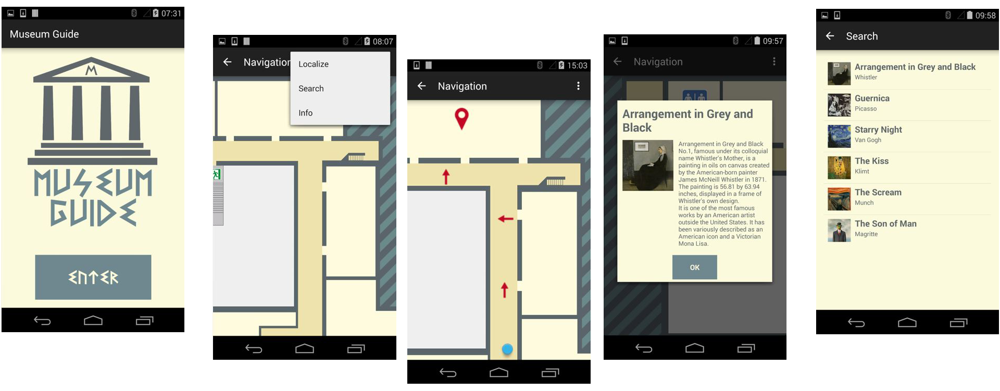

# MuseumGuide
Museum Guide is an application that allows an user with an Android device to explore the museum and to obtain information about the exposed pictures.
The application performs navigation and localization by means of the Bluetooth signal transmitted by iBeacons placed in the museum area.

## Map
The map is described with the IndoorGML standard and interpreted by the application by means of a parser.
However, the graphical rendering, such as zooming and moving, is done by the TileView library.
The experiment takes place on the second floor of Polo A of engineering faculty, where ten beacons are spread in known positions.

## Localization
Museum Guide recognizes the user’s location selecting the unique identifier of the beacon with the strongest signal strength.
The used beacons are those producted by Kontakt, and the application works with its SDK.
In order to save energy consumption and reach stability, its monitor period is composed by two phases both 5 seconds long: during the first phase, the device looks for the nearest beacon; in the second one, it is idle.

## Menu
The menu allows the user to:
- Localize himself moving the focus on his position;
- Search for a picture;
- Obtain Info about the picture close to him, if there is any.

## Search
In the search activity, the user may choose among the available pictures the one he wants to visit.
The list is created dynamically reading an XML file containing all the pictures of the museum and their information.

## Navigation
Once the user selects a picture from the list, the application will show the way to reach the destination.
The path is found using the Dijkstra’s algorithm on the graph representing the sensor network.
The route is indicated by arrows drawn on the map.

## Information
When the user reaches a sensor placed on a paint, the application shows a pop-up window containing the current picture’s information.
The same information is available pressing the Info menu button, if the user is in a location with a picture.

## Screenshots

## References
- IndoorGML specifications of OGC: http://www.opengeospatial.org/standards/indoorgml
- TileView library: https://github.com/moagrius/TileView
- Kontakt iBeacon: http://docs.kontakt.io/android-sdk/quickstart/ http://docs.kontakt.io/android-sdk/javadoc/index.html
